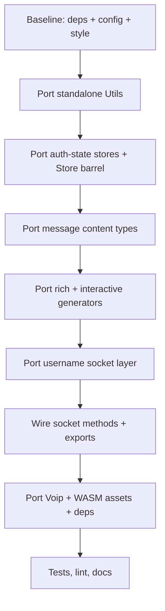

# Port `baileys-innovators` features into the upstream Baileys tree

## Scope

**Full port, including the Voip/WASM call engine**, per user decision.

## Objective

Replicate the additive features shipped by [`@innovatorssoft/baileys`](Baileys-innovators/package.json) into the upstream Baileys source tree under [`src/`](src/index.ts), without breaking existing public APIs.

## Key architectural differences to respect during porting

| Concern | Upstream (`src/`) | Fork (`Baileys-innovators/lib/`) |
|---|---|---|
| Module system | ESM (`"type": "module"`) | CommonJS (`"use strict"`, `require`) |
| Indentation / quotes / semicolons | Tabs, single quotes, no semicolons | 4 spaces, double quotes, semicolons |
| Signal lib | `libsignal` | `@itsukichan/libsignal-node` |
| Package manager | Yarn 4 (Corepack) | Yarn 1 |
| Build | `tsc -P tsconfig.build.json && tsc-esm-fix` | plain `tsc` |
| `WAMediaUpload` | `Buffer \| {stream} \| {url}` | adds `\| string` |

The fork sources are **compiled JS + `.d.ts`** only — there is no TypeScript source to copy verbatim. Every ported module must be re-authored in upstream TS style (tabs, no semicolons, `import type`), following [`AGENTS.md`](AGENTS.md).

> Important: the Voip module is only partially compiled to `.js`. Its WASM engine entry points ([`lib/Voip/index.js`](Baileys-innovators/lib/Voip/index.js)) are thin re-export shims that lazily `import('./index.mjs')`, while the actual implementation lives in `.mjs` files ([`lib/Voip/signaling.mjs`](Baileys-innovators/lib/Voip/signaling.mjs)) plus a compiled WASM binary and loader ([`lib/Assets/Wasm/`](Baileys-innovators/lib/Assets/Wasm/loader.js), `whatsapp.wasm`). Porting this requires copying the `.mjs` sources, the WASM assets, and re-exporting through the ESM barrel — it is the highest-risk and highest-dependency item.

## Feature inventory (present in fork, absent in upstream)

### A. Standalone utility modules (pure client-side, no wire protocol)

| Feature | Fork file | Notes |
|---|---|---|
| Anti-delete store + handler | [`lib/Utils/anti-delete.d.ts`](Baileys-innovators/lib/Utils/anti-delete.d.ts) | `MessageStore`, `createAntiDeleteHandler` |
| Auto-reply handler | [`lib/Utils/auto-reply.d.ts`](Baileys-innovators/lib/Utils/auto-reply.d.ts) | `AutoReplyHandler`, keyword/regex rules |
| Message scheduler | [`lib/Utils/scheduling.d.ts`](Baileys-innovators/lib/Utils/scheduling.d.ts) | `MessageScheduler` |
| Typing / read-receipt / pin controls | [`lib/Utils/chat-control.d.ts`](Baileys-innovators/lib/Utils/chat-control.d.ts) | `TypingIndicator`, `ReadReceiptController`, `PinnedMessagesManager` |
| vCard builder | [`lib/Utils/vcard.d.ts`](Baileys-innovators/lib/Utils/vcard.d.ts) | `generateVCard`, `createContactCard` |
| Status posting helper | [`lib/Utils/status-posting.d.ts`](Baileys-innovators/lib/Utils/status-posting.d.ts) | `StatusHelper`, `STATUS_BACKGROUNDS` |
| Message templates | [`lib/Utils/templates.d.ts`](Baileys-innovators/lib/Utils/templates.d.ts) | `TemplateManager`, variable interpolation |
| Message search | [`lib/Utils/message-search.d.ts`](Baileys-innovators/lib/Utils/message-search.d.ts) | `MessageSearchManager`, relevance scoring |
| JID plotting / LID | [`lib/Utils/jid-plotting.d.ts`](Baileys-innovators/lib/Utils/jid-plotting.d.ts) | `parseJid`, `plotJid`, `getSenderPn` |
| Auth-state stores | [`lib/Utils/use-single-file-auth-state`](Baileys-innovators/lib/Utils/use-single-file-auth-state.d.ts), [`use-mongo-file-auth-state`](Baileys-innovators/lib/Utils/use-mongo-file-auth-state.d.ts) | upstream only has `use-multi-file-auth-state` |

### B. Rich / AI-style message generators (wire-level, uses `botForwardedMessage` + `richResponseMessage`)

| Feature | Fork file | Socket methods |
|---|---|---|
| Rich message composer | [`lib/Utils/message-composer.d.ts`](Baileys-innovators/lib/Utils/message-composer.d.ts) | `sendTable`, `sendList`, `sendCodeBlock`, `sendMarkdown`, `sendLatexImage`, `sendLatexInlineImage`, `sendRichMessage`, `captureUnifiedResponse`, `sendUnifiedResponse` |
| Rich message utils (bot metadata, code tokenizer) | [`lib/Utils/rich-message-utils.d.ts`](Baileys-innovators/lib/Utils/rich-message-utils.d.ts) | internal to composer |
| Rich type enums | [`lib/Types/RichType.d.ts`](Baileys-innovators/lib/Types/RichType.d.ts) | `CodeHighlightType`, `RichSubMessageType` |

> Upstream `WAProto` **already contains** `AIRichResponseMessage`, `AIRichResponseSubMessage`, `botForwardedMessage`, `richResponseMessage`, `ShopMessage`, `CollectionMessage`, `NativeFlowMessage` — so no protobuf regeneration is required for these.

### C. Interactive message generators (wire-level, existing proto)

| Feature | Fork file |
|---|---|
| Interactive/button/list/template/native-flow builders | [`lib/Utils/interactive-message.d.ts`](Baileys-innovators/lib/Utils/interactive-message.d.ts) |
| Combined buttons (url/reply/copy/call) | same file |

### D. Socket capability additions

| Feature | Fork layer | Upstream status |
|---|---|---|
| Username management (`checkUsername`, `setUsername`, `getMyUsername`, `findUserByUsername`, `fetchContactUsernames`, query-ID constants) | [`lib/Socket/username.js`](Baileys-innovators/lib/Socket/username.js) | Missing; upstream only has low-level `USyncUsernameProtocol` |
| Rich message methods (`sendTable`, etc.) | [`lib/Socket/messages-send.js`](Baileys-innovators/lib/Socket/messages-send.js) | Missing |
| `sendStatusMentions`, `updateMediaMessage`, `getLidUser` | [`lib/Socket/messages-send.d.ts`](Baileys-innovators/lib/Socket/messages-send.d.ts) | Partial/absent |
| Voip module (WASM call engine) | [`lib/Voip/`](Baileys-innovators/lib/Voip/index.d.ts) | Absent; high risk, large dependency surface |

### E. Type surface additions in [`src/Types/Message.ts`](src/Types/Message.ts)

- `richResponse` content union member
- `RichMessageHelpers` (code / links / table)
- `Shopable`, `Collectionable`, `Cardsable`, `Interactiveable` mixins
- `interactiveAsTemplate`, `nativeFlow`, `offerText/offerCode`, `shop`, `collection`, `cards`

### F. Store module exports

Fork exports a `Store` barrel ([`lib/Store/index.d.ts`](Baileys-innovators/lib/Store/index.d.ts)): `make-cache-manager-store`, `make-in-memory-store`, `make-ordered-dictionary`, `object-repository`. Upstream has no `src/Store` barrel.

## Recommended implementation order

## Risks / decisions to confirm before implementation

1. **Signal lib**: Fork swaps `libsignal` for `@itsukichan/libsignal-node`. Upstream must keep `libsignal` — ported modules should not depend on the fork's signal swap. The Voip signaling bridge calls `getUSyncDevices` with the fork's 3-arg signature (`jids, ignoreZeroDevices, forceQuery`); upstream's signature is `(jids, useCache, ignoreZeroDevices)` — this must be adapted.
2. **Wire protocol risk**: `richResponseMessage` / `botForwardedMessage` builders encode bot metadata. These must match the exact proto shape in upstream `WAProto` (already present), but the `botMetadataSignature()` / certificate logic in [`rich-message-utils`](Baileys-innovators/lib/Utils/rich-message-utils.d.ts) needs verification against a live session.
3. **Username query IDs**: Fork hardcodes `xwa2_*` Mex query IDs in [`username.js`](Baileys-innovators/lib/Socket/username.js). These are WA-version-sensitive and must live in a constants file, not be hand-verified without a session.
4. **Voip dependency surface**: The Voip module requires `@roamhq/wrtc`, a prebuilt WASM binary (`whatsapp.wasm`), its loader, and worker modules. These binary assets must be copied verbatim (cannot be hand-authored), which conflicts with the "regenerate don't hand-edit" rule — treat the WASM assets as vendored third-party binaries. This also adds significant install weight and native/WASM threading concerns (`pthread` emscripten).
5. **Dual module system in Voip**: The fork mixes `.js` (CJS shim) + `.mjs` (ESM implementation). Upstream is ESM-only, so the CJS shim must be dropped and the `.mjs` implementations imported directly.
6. **`@whiskeysockets/baileys` self-import**: [`signaling.mjs`](Baileys-innovators/lib/Voip/signaling.mjs) dynamically imports `@whiskeysockets/baileys` with a fallback to `../index.js`. Since we are inside the same package, this must become a direct internal import of the upstream helpers (`decodeBinaryNode`, `getBinaryNodeChild`, `jidNormalizedUser`, etc.).
